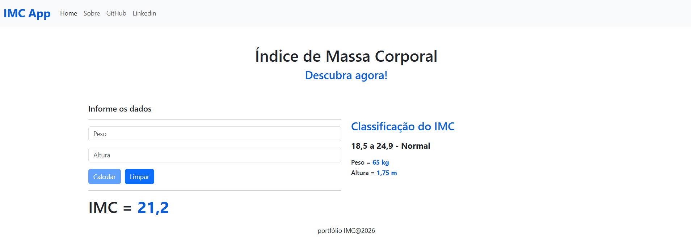

# IMC App
### Feito com Angular

- IMC App: [visite a aplicação aqui](https://albuquerque-katarine.github.io/angular-imc-app/)

## Objetivo

* Calcular o IMC (Índice de Massa Corporal) com base no peso e altura do usuário.
* Informar a classificação do resultado (baixo peso, peso normal, sobrepeso, obesidade etc.).
* Exibir resultados de forma rápida, simples e intuitiva.

## Finalidade

* Facilitar o cálculo do IMC de maneira automática.
* Auxiliar usuários a entenderem sua condição corporal.
* Fornecer uma referência inicial sobre faixa de peso ideal.

## Desenvolvimento Front-end com Angular

* Estrutura de Componentes
* Criação e reutilização de componentes
* Comunicação entre componentes
* Data Binding no Angular
* Fluxo de Dados (Data Flow)
* Reactive Forms
  * FormControl e FormGroup
  * Validações
  * Manipulação de eventos do formulário
* Estilização da Interface com Bootstrap

## Iniciar aplicação

* `npm install` (instala as dependências)
* `ng s` (inicia o servidor no modo desenvolvimento)

## Contatos
- E-mail: [kba.2879@gmail.com](mailTo:kba.2879@gmail.com)
- Linkedin: [/katarine-albuquerque](https://www.linkedin.com/in/katarine-albuquerque/)